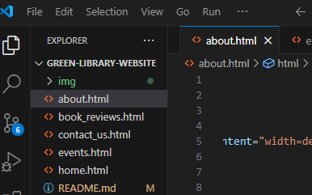
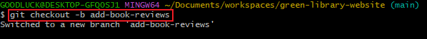
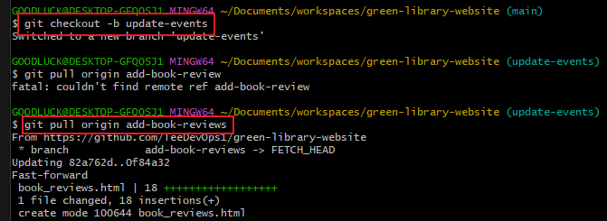
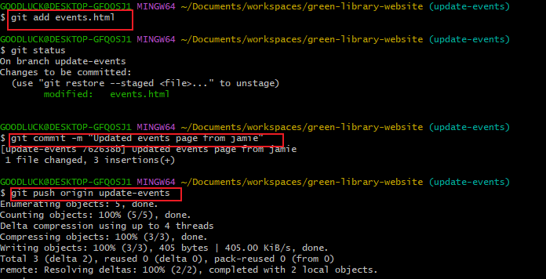

## Capstone Project: Enhancing Community Library Website

### Background Scenerio
As part of a develpment team tasked to enhance  Greenwood Community Library. My team is tasked with enhancing the website for the library. This includes the following sections: Home, About_us, Events and Contact_us. 
We are are to add Book Reviews sections and also update the events page.

Here are the steps i took to accomplish this project.

1. Create a Repository on Github
2. Name it green-library-website

3. Initialized the Readme file 
4. I cloned the Repository to my local machine.

From the main branch, I added files/Pages which included contents that served as the existing codebase for the website.
These files include: 
* home.html
* About_us.html
* Events.html
* Contact_us.html

### Adding Book Reviews
Here are the steps i used to simulate Morgan's work.
1. Create a branch for Morgan
2. Switched to a new branch named add-book-reviews

3. Added anew file Book_reviews.html to represent the book reviews section.
4. Added a random text content inside the file.

5. Staged and Commit book reviews section
 

6. pushed the changes to the repository.

7. Raised a pull request for morgan's book-reviews-section and merged it to the main branch.

## Jamie's work: Updating Events Page
jamie was tasked to update the events page to include upcoming community events.

here are the steps i took to achieve this:
1. I created a branch for jamie and pulled the latest changes from the main branch into update-events

2. I updated the events page and added some new contents using vscode.
3. I staged, commit and pushed the changes to Github

4. Finally, i raised a PR for jamie's Update-Evenys and merged it to the main branch.

